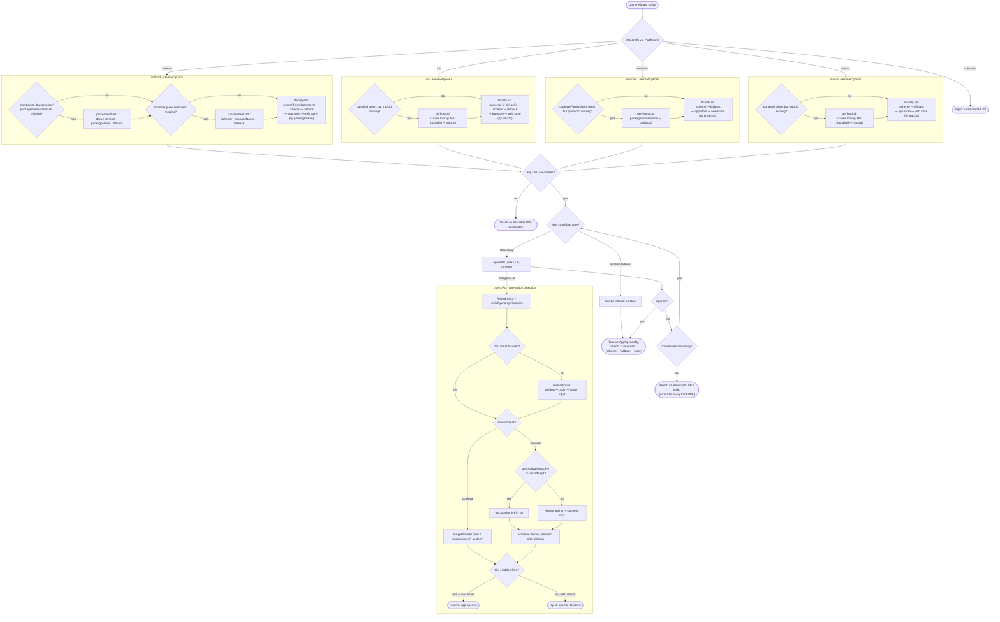

# web-launch-kit

A TypeScript library for launching **external apps** and **communication intents**
from the web. Handles deep links / custom schemes, Android `intent://` URLs, iOS
universal links, and App Store / web-store fallbacks — trying each candidate in
order until one succeeds. Also covers `tel`, `sms`, `mailto`, a file picker, and
system-settings deep links.

```bash
npm install web-launch-kit
```

The bundle is self-contained (OS/locale detection is inlined) — no peer scripts required.

## API at a glance

`LaunchKit` is a singleton.

| Member | Signature | Description |
| --- | --- | --- |
| `LaunchKit.version` | `string` | The installed package version |
| `LaunchKit.SettingType` | `enum` | Setting panes: `General`, `Network`, `Display`, `Appearance`, `Accessibility`, `Battery`, `Datetime`, `Language`, `Accounts`, `Storage` |
| `LaunchKit.app(options?)` | `Promise<AppOpenedBy>` | Launch an app via the best available route; resolves with which route opened it |
| `LaunchKit.telephone(options?)` | `Promise<void>` | Open the dialer (`tel:`) |
| `LaunchKit.message(options?)` | `Promise<void>` | Open the SMS composer (`sms:`) |
| `LaunchKit.mail(options?)` | `Promise<void>` | Open the mail composer (`mailto:`) |
| `LaunchKit.filepicker(options?)` | `Promise<File[]>` | Pick files or a directory (File System Access API, with input fallback) |
| `LaunchKit.setting(type?)` | `Promise<void>` | Open a system-settings pane where supported |
| `LaunchKit.utils` | object | `canOpenIntent` / `canOpenUniversal` / `canOpenSetting` getters, plus async `getTrackId` / `getProductId` |

`AppOpenedBy` is one of: `"scheme"`, `"universal"`, `"intent"`, `"fallback"`, `"store"`.

Named exports `getProductId` / `getTrackId` (synchronous store-id lookups) are also available.

---

## Launching an app

`app()` takes per-platform options and only acts on the block matching the current
OS. It builds an ordered list of candidates and tries each until one launches the
app, resolving with the route that worked.



```js
import LaunchKit from 'web-launch-kit'

const openedBy = await LaunchKit.app({
	android: {
		scheme: 'ms-excel://',
		packageName: 'com.microsoft.office.excel',
		intent: 'intent://#Intent;scheme=ms-excel;package=com.microsoft.office.excel;action=android.intent.action.VIEW;category=android.intent.category.BROWSABLE;S.browser_fallback_url=https%3A%2F%2Fplay.google.com%2Fstore%2Fapps%2Fdetails%3Fid%3Dcom.microsoft.office.excel;end',
		fallback: 'https://www.microsoft.com/ko-kr/microsoft-365/excel',
		allowAppStore: true,
		allowWebStore: false,
		timeout: 1000,
	},
	ios: {
		scheme: 'ms-excel://',
		bundleId: 'com.microsoft.Office.Excel',
		trackId: '586683407',
		universal: 'https://1drv.ms/x/c/7f3d9a02c81b4e65/IQBk2wYfN8pTQ5vHmR9xLzUcAeXtP0jWnK4oD3iFgZs7bQY?e=Rk9mZ2',
		fallback: 'https://www.microsoft.com/ko-kr/microsoft-365/excel',
		allowAppStore: true,
		allowWebStore: false,
		timeout: 2000,
	},
	windows: {
		scheme: 'ms-excel://',
		packageFamilyName: 'Microsoft.Office.Desktop_8wekyb3d8bbwe',
		productId: 'cfq7ttc0pr28',
		fallback: 'https://www.microsoft.com/ko-kr/microsoft-365/excel',
		allowAppStore: true,
		allowWebStore: false,
		timeout: 750,
	},
	macos: {
		scheme: 'ms-excel://',
		bundleId: 'com.microsoft.Excel',
		trackId: '462058435',
		fallback: 'https://www.microsoft.com/ko-kr/microsoft-365/excel',
		allowAppStore: true,
		allowWebStore: false,
		timeout: 750,
	}
})

console.log(openedBy) // "universal" | "scheme" | "intent" | "fallback" | "store"
```

Per-platform fields: Android accepts `intent` / `scheme` / `packageName` / `fallback`
(scheme ⇄ intent are derived from each other); iOS accepts `universal` / `scheme` /
`bundleId` / `trackId`; Windows accepts `scheme` / `packageFamilyName` / `productId`;
macOS accepts `scheme` / `bundleId` / `trackId`. All accept `fallback`, `timeout`,
`allowAppStore`, `allowWebStore`.

## Communication intents

```js
import LaunchKit from 'web-launch-kit'

await LaunchKit.telephone({ to: '+821012345678' })

await LaunchKit.message({ to: '+821012345678', body: 'hello' })

await LaunchKit.mail({
  to: ['a@example.com', 'b@example.com'],
  cc: 'c@example.com',
  subject: 'Hi',
  body: 'from web-launch-kit',
})
```

## File picker

```js
import LaunchKit from 'web-launch-kit'

// Files (uses showOpenFilePicker where available, falls back to <input type=file>)
const files = await LaunchKit.filepicker({ accept: ['image/*', '.pdf'], multiple: true })

// A directory (recursive; webkitRelativePath is populated)
const tree = await LaunchKit.filepicker({ directory: true })
```

## System settings

```js
import LaunchKit from 'web-launch-kit'

if (LaunchKit.utils.canOpenSetting) {
  await LaunchKit.setting(LaunchKit.SettingType.Network)
}
```

## CommonJS / UMD

The bundle is built with `exports: "named"`, so the singleton lives under `.default`:

```js
const { default: LaunchKit } = require('web-launch-kit')
```

```html
<script src="https://unpkg.com/web-launch-kit/dist/launch-kit.umd.min.js"></script>
<script>
    window.LaunchKit.default.telephone({ to: '+821012345678' })
</script>
```

---

## Notes

- **Deep links need a real user gesture.** Universal links and custom schemes are
  unreliable when triggered programmatically or from a same-origin context — they
  fall back to the web instead of opening the app. Call `app()` from a click/tap handler.
- **`app()` resolves with the route, not a guarantee of launch.** Detection relies on
  focus/visibility heuristics with per-OS timeouts; a resolved `AppOpenedBy` means that
  candidate was attempted and the page appeared to background, not a hard confirmation.
- **`utils.getTrackId` / `getProductId` are async**; the named `getTrackId` / `getProductId`
  exports are synchronous (blocking XHR) and intended for internal/legacy use.
- **Store-id lookups depend on remote APIs** (iTunes Lookup, Microsoft display catalog)
  and are cached for one hour; failures resolve to `undefined` rather than throwing.
